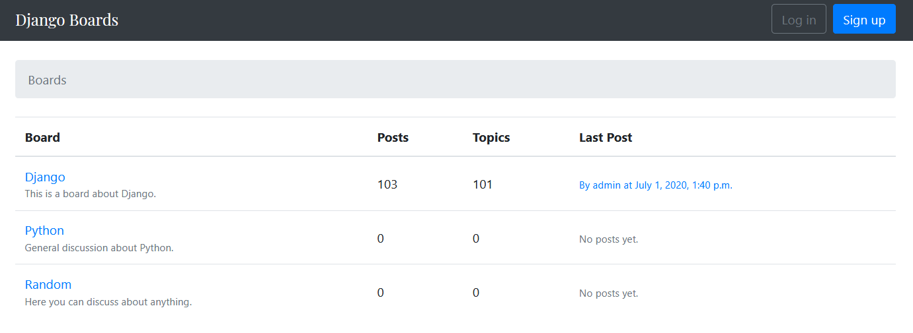

# Forum

   

Forum with topics, pages and comments based on Django.

## Description

Shop allows to:

- create boards
- start new topics
- reply to other users
- use markdown in replies
- create and edit user profiles

## Requirements

- python3.8+
- pip
- virtualenv
- Django3.0+

### Virtual environment

Please pay attention that env variables should be places at the end of file `venv/bin/activate` (Linux) or `venv/Scripts/activate` (Windows) for security reasons. Also, they should be unset in function `deactivate`

#### activate
```bash

deactivate() {
    ...

    unset SECRET_KEY
}

...
export SECRET_KEY="key"
```

## Example

